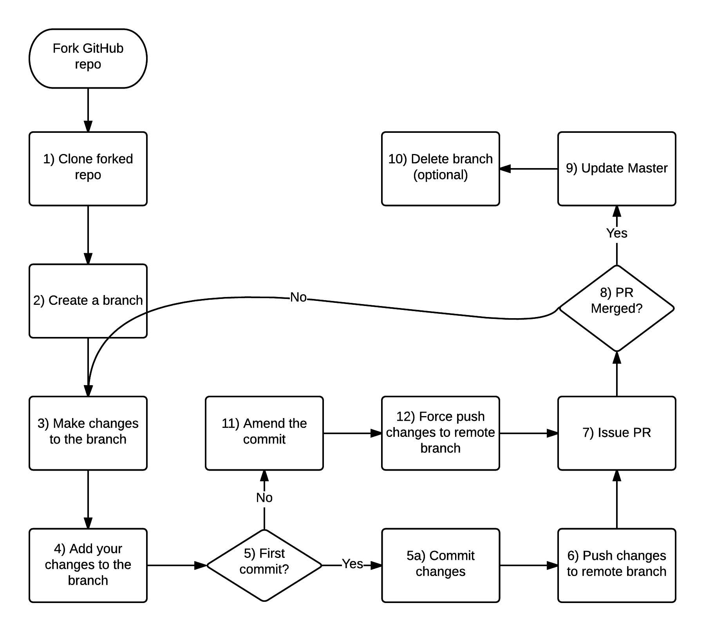

// vim: set syntax=asciidoc:
[[git_tutor]]
= Git Tutor
:data-uri:
:icons:
:toc:
:toclevels 4:
:numbered:
:homepage https://github.com/cloud-practice/:

== Git Setup
. Create github account 
. Add your SSH public key via *Settings -> SSH Keys -> Add SSH Keys*
. Paste your public key (+ssh-key-gen+ if you need one)
. Install git
+
----
yum -y install git
----
+
Or:
+
----
brew install git
----
+
. Configure git
+
----
git config --global user.name "Your Name Comes Here"
git config --global user.email you@youremail.example.com
git config --global color.branch auto
git config --global color.diff auto
git config --global color.interactive auto
git config --global color.status auto
git config --global push.default simple
----
+
. Add this to your +~/.bashrc+ to provide branch detail when in a git repo
+
----
export PS1="[\u@\h \W\$(git branch 2> /dev/null | grep -e '\* ' | sed 's/^..\(.*\)/{\1}/')]\$ "
----

== Git Workflow

The following diagram give a general sequence of steps that occur in a typical workflow.

.Git Workflow

=== Fork a repo

. Fork the repo in github (top right): https://github.com/cloud-practice/git-tutor
. Clone your forked repo. You can get the SSH url from your github repo page on the right side, it will be similar to:
+
----
git clone git@github.com:{YOUR_GITHUB_USERNAME_HERE}/git-tutor.git
----
+
. Change to the directory of the newly cloned repo
+
----
cd git-tutor
----
+
. Set a remote of upstream to be the original project that was forked
+
----
git remote add upstream git@github.com:cloud-practice/git-tutor.git
----

=== Development Workflow

. Create a branch. A branch is a topic that contains a set of related changes 
+
----
git branch <YOUR_BRANCH_NAME>
----
+
. Check the branch out to begin working on it
+
----
git checkout <YOUR_BRANCH_NAME>
----
. Make changes. For this lab add your github username to the file "completed.lab"
+
IMPORTANT: This must match EXACTLY to your github username as this file will be used to add access to the rest of the labs!
+
----
echo "YOUR_GITHUB_USERNAME">> completed.lab
----
. Test changes and verify
+
----
git diff
----
+
. Add files that will be committed
+
----
git add completed.lab <OTHER_FILES>
----
+
. Commit changes
+
----
git commit
----
+
NOTE: The commit message should provide meaningful information and use the imperative, present tense: "change", not "changed" or "changes". Think of it in terms of completing the imperative statement "This commit will do the following if it is applied as a patch: __________". The commit message should fill in the blank. e.g. "fix compile errors in chapter 2".
+
. It is good practice to pull the latest upstream to make sure there will be no merge conflicts. Switch to your master branch:
+
----
git checkout master
----
+
. First fetch the latest upstream
+
----
git fetch upstream 
----
+
. Rebase or merge against the upstream master branch
+
----
git rebase upstream/master
----
+
or:
+
----
git merge upstream/master
----
+
. If there are no conflicts, push to a remote branch on your origin (your github fork)
+
NOTE: If there are merge conflicts see below
+
NOTE: You only have to set the upstream branch one time
+
----
git push --set-upstream origin <branch name>
----
+
. Go to github.com and initiate a pull request
+
NOTE: Usually github will detect the change and offer a "Compare and Pull Request" button, but sometimes you may need to select the dropdown that is defaulted to "master" and change to the branch that was pushed and click on "pull request", or just initiate a new pull request from the menu on the right side.

==== Update your origin (fork)
This is the same step recommended before a push, replicated here.

. After a pull request is approved, pull changes. First change to your master branch
+
----
git checkout master
----
+
. Go to github.com and initiate a pull request

=== Update your origin (fork)
This is the same step recommended before a push, replicated here.

. Fetch the latest upstream
+
----
git fetch upstream
----
+
. Rebase against the upstream master branch
+
----
git rebase upstream/master
----
+
. Now update your origin (github fork) with the latest change from upstream
+
----
git push
----

=== Resolving a Merge Conflict
A merge conflict can occur for many reasons. Typically it is when you make a change to the same line that someone else changes but their change was merged first, so git can't automatically determine what to do. This is relatively easy but must be manually addressed.

. If a rebase or merge results in a conflict, use a diff/merge tool such as _vimdiff_ or _gvimdiff_. If you do not have one installed do so
+
For Linux:
+
----
yum -y install vim-enhanced vim-X11
----
+
For Mac OS X:
+
----
brew install macvim
----
+
NOTE: You may need to install Xcode first.
+
. Use +mergetool+ to bring up the conflicting files for inspection
+
----
git mergetool
----
+
. The display will be divided into 4 main areas
+
.Merge Conflict Review Panes in {g,}vimdiff
|==================================
^|upstream version ^| common content  ^| branch version
3+^.^|  unresolved conflicts
|==================================
+
.. Top left = upstream version of the file
.. Top right = your branch version of the file
.. Top middle = content between the two files that is the same
.. Bottom = unresolved conflicts to handle
+
. Make changes to the bottom pane and save and quit. With +vim+ or +gvim+ it is
+
----
:wqa
----
+
. Add modified file(s). In this case it would likely be
+
----
git add completed.lab
----
+
. Commit the change
+
----
git commit
----
+
. If the conflict was a result of a rebase conflict, continue the rebase and make sure everything merges
+
----
git rebase --continue
----
+
. Push the commit to your remote branch
+
----
git push
----
